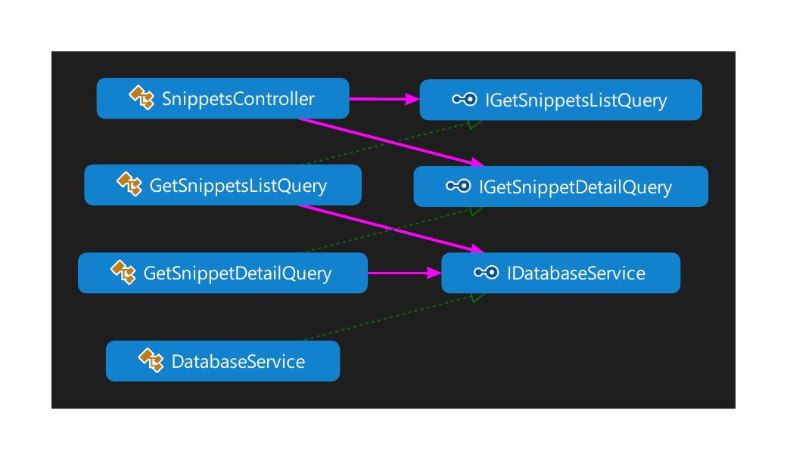

# Snippet Manager 
## Using Clean Architecture techniques
_Based on templates and work created by http://www.matthewrenze.com as part of his Pluralsight course https://app.pluralsight.com/library/courses/clean-architecture-patterns-practices-principles_

- Does NOT use DDD principles - has anaemic domain models, and uses basic CRUD
- Business objects are kept separate from implementation details

## Architecture
### Solution

### Domain

### Microservice

### Commands

### Queries

### Tests
